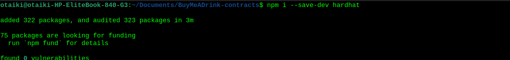
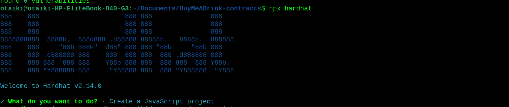
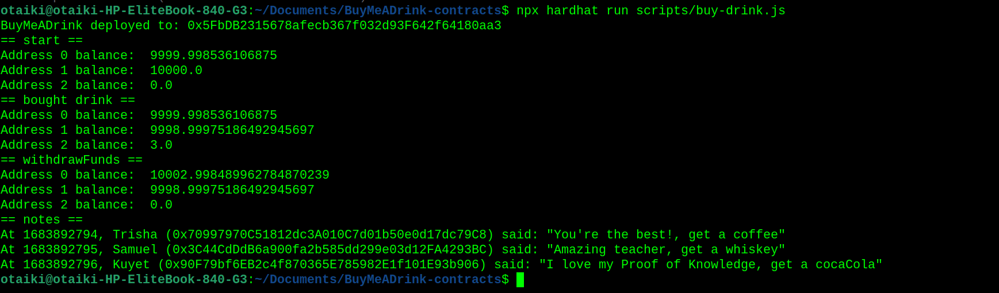
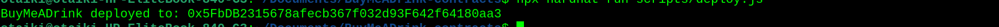

# Building "Buy Me a Drink" Decentralized Application (DApp) on the Celo Blockchain:

## Table of Contents:

- [Building "Buy Me a Drink" Decentralized Application (DApp) on the Celo Blockchain](#building-a-buy-me-a-drink-decentralized-application-on-the-celo-blockchain)
  - [Table of Contents](#table-of-contents)
  - [Introduction](#introduction)
    - [The Blockchain](#the-blockchain)
    - [Solidity](#solidity)
    - [The Celo Blockchain](#the-celo-blockchain)
    - [Smart Contracts](#smart-contracts)
  - [Requirements](#requirements)
  - [Pre-requisites](#pre-requisites)
  - [Building the "Buy me a Drink " System](#building-the-buy-me-a-drink--system)
  - [Create a buy-drink.js Script to Test Your Contract](#create-a-buy-drinkjs-script-to-test-your-contract)
  - [Deploy Your BuyMeADrink.sol Smart Contract Locally Using Hardhat](#deploy-your-buymeadrinksol-smart-contract-locally-using-hardhat)
  - [Contract Deployment on the Blockchain](#contract-deployment-on-the-blockchain)
    - [Using Remix](#using-remix)
    - [Create and Compile Programs](#create-and-compile-programs)
    - [Add Celo Extension](#add-celo-extension)
    - [Deploying Code to Celo Blockchain](#deploying-code-to-celo-blockchain)
  - [What’s Next?](#whats-next)
  - [Conclusion](#conclusion)
  
## Introduction:

A common concept called "**Buy Me A Drink**" is used by different types of professionals to make landing pages where visitors can donate money as a thank you for their work. But you need to have a bank account and a credit card to use it and people might not have this. The blockchain solves this and with the Celo blockchain, this can be a pretty seamless process.

In this tutorial, we'll go through the process of building a Smart Contract that handles the "Buy Me a Drink" process on the Celo blockchain. The contract will allow users to send funds for purchasing drinks to the professionals and at the same time allow the professionals to withdraw these funds,  all powered by Smart Contracts. Don't worry if you're new to blockchain technology or programming – all the steps will be explained thoroughly as we build.

### The Blockchain: 

The blockchain is a decentralized, immutable ledger that makes it easier to track assets and record transactions in a corporate network. An asset might be physical (a house, car, money or piece of land) or intangible (patents, copyrights, branding and intellectual property). On a blockchain network, practically anything of value may be recorded and traded, lowering risk and increasing efficiency for all parties.

### Solidity: 

[Solidity](https://sourceforge.net/projects/solidity.mirror/) is an object-oriented programming language that was created by the Ethereum platform's core developers. Within the Ethereum Virtual Platform and various other Blockchain systems like the Celo blockchain, it is utilized to create Smart Contracts that provides self-enforcing business logic.

### The Celo Blockchain: 

A robust new digital economy is being led by the blockchain ecosystem Celo which is carbon-neutral, mobile-first and EVM-compatible. Celo was created to enable quick cryptocurrency transactions for mobile users all around the world. The platform contains a native coin called CELO and its own blockchain.

### Smart Contracts:

Smart Contracts are self-executing contracts with pre-defined rules encoded on the blockchain. They automatically execute transactions when specific conditions are met.

We can now move on to creating a "Buy me a drink" system utilizing Solidity as you are already familiar with the fundamentals of the [Blockchain](https://aws.amazon.com/what-is/blockchain/?aws-products-all.sort-by=item.additionalFields.productNameLowercase&aws-products-all.sort-order=asc), Solidity and Celo.

## Requirements:

Before we begin, let's make sure you have everything you need:

1. A computer with an internet connection.
2. A modern web browser like [Google Chrome](https://www.google.com/chrome/?brand=CHBD&brand=CHBD&gclid=CjwKCAjw6vyiBhB_EiwAQJRopnWxmmqUVYSjlc9f5-Y2VW9OwZLY_KcvEpYS8yvyVyYzrUL0IQpmlhoCe7EQAvD_BwE&gclsrc=aw.ds) or [Mozilla Firefox](https://mozilla-firefox.en.softonic.com/?ex=DINS-635.2).
3. [The Celo Extension Wallet](https://docs.celo.org/wallet#celoextensionwallet).
4. Install [Node.js](https://nodejs.org/en) and [Node Package Manager](https://www.npmjs.com/package/download) (NPM).

## Pre-requisites:

To follow this tutorial, you'll need to have a basic understanding of the following:

1. Command Line
2. [JavaScript](https://www.w3schools.com/js/)
3. [Solidity](https://sourceforge.net/projects/solidity.mirror/)

## Building the "Buy me a Drink" System:

Open your terminal and create a new directory and change the directory into it using the following commands:

```bash
mkdir BuyMeADrink-system
cd BuyMeADrink-system
```

Inside this directory, we want to initialize a Hardhat project.

- First we install Hardhat:
  ```bash
  npm install --save-dev hardhat
  ```

 

- Then we create a sample project: 
  ```bash
  npx hardhat
  ```



You should then see a welcome message and options on what you can do. Select `Create a JavaScript project:`

Agree to all the defaults (project root, adding a .gitignore and installing all sample project dependencies):

Hardhat will then generate a `hardhat.config.js` file for us along with a couple of folders with sample code we can work with, including contracts, scripts and tests.

To check if everything works properly, run:
```bash
 npx hardhat test
```

We now have our hardhat development environment successfully configured.

You can then open the folder with VS Code and you will have a set of files/folders:

1. `contracts` - The folder where your smart contracts are.

2. `scripts` - The folder where your Hardhat scripts live.

We will write deploy logic:
- For example `buy-drink` script and a `withdraw` script to cash out our funds.

- `hardhat.config.js` - Configuration file with settings for Solidity version and deployment.

You'll notice that there are a number of files already auto-generated via the Hardhat sample project tool. We will be replacing all of them, starting with the Lock.sol contract.

1. Rename the contract file to `BuyMeADrink.sol`.
2. Replace the contract code with the following:

```solidity 
// SPDX-License-Identifier: MIT

// contracts/BuyMeADrink.sol
pragma solidity ^0.8.0;

contract BuyMeADrink {
// Event to emit when a Note is created.
event NewNote(
address indexed from,
uint256 timestamp,
string name,
string message
);

  // Note struct.
struct Note {
    address from;
    uint256 timestamp;
    string name;
    string message;
}

// Address of contract deployer. Marked payable so that
// we can withdraw to this address later.
address payable public owner;

// List of all Notes received from drink purchases.
Note[] public notes;

constructor() {
    // Store the address of the deployer as a payable address.
    // When we withdraw funds, we'll withdraw here.
    owner = payable(msg.sender);
}

/**
 * @dev fetches all stored notes
 */
function getNotes() public view returns (Note[] memory) {
    return notes;
}

modifier nonZeroAddress() {
    require(msg.sender != address(0), "Invalid address");
    _;
}

function buyDrink(string calldata _name, string calldata _message) public payable nonZeroAddress {
    // Must accept more than 0 ETH for a drink .
    require(msg.value > 0, "Can't buy drink for free");

    require(bytes(_name).length > 0, "Name is required");
    require(bytes(_message).length > 0, "Message is required");

    // Add the memo to storage!
    notes.push(Note(
        msg.sender,
        block.timestamp,
        _name,
        _message
    ));

    // Emit a NewNote event with details about the Note.
    emit NewNote(
        msg.sender,
        block.timestamp,
        _name,
        _message
    );
}

/**
 * @dev send the entire balance stored in this contract to the owner
 */
function withdrawFunds() public {
    require(msg.sender == owner, "Only owner can withdraw funds");
    require(address(this).balance > 0, "No funds to withdraw");
    (bool success,) = payable(owner).call{value: address(this).balance}("");
    require(success, "Withdraw failed");
}
}
```

Now, let's break down the code:

- The event `NewNote` is defined to emit an event when a Note is created. It includes the address of the sender, the timestamp, the name and the message of the `Note`.

- The `Note` struct defines the structure of each note, containing the address of the sender, timestamp, name, and message.

- The `owner` variable stores the address of the contract deployer. It is marked as payable so that funds can be withdrawn to this address later.

- The `notes` array holds all the notes received from drink purchases.

- The constructor function is executed when the contract is deployed. It initializes the `owner` variable with the address of the deployer.

- The `getNotes` function is a public view function that returns an array of all the stored notes.

- The `buyDrink` function allows users to buy a drink for the contract owner by sending the amount for the drink and leaving a note. It requires the sent value to be greater than 0 CELO. The function adds the `Note` to the `notes` array and emits a `NewNote` event with the note details.

- The `withdrawFunds` function allows the owner to withdraw the entire balance stored in the contract. It ensures that only the owner can call this function and transfers the contract's balance to the owner's address.

This contract enables users to buy a drink for the contract owner, leaving a memo along with their purchase. The owner can later withdraw the accumulated funds.

Armed with this Smart Contract code, we can now write a script to test our logic!

## Create a buy-drink.js Script to Test Your Contract:

Under the scripts folder, there should be a sample script already populated `deploy.js`. Let's rename that file to `buy-drink.js` and paste in the following code:

```js

// Import hardhat.
const hre = require("hardhat");

// Returns the CELO balance of a given address.
async function getBalance(address) {
  const balanceBigInt = await hre.ethers.provider.getBalance(address);
  return hre.ethers.utils.formatEther(balanceBigInt);
}

// Logs the CELO balances for a list of addresses.
async function printBalances(addresses) {
  let idx = 0;
  for (const address of addresses) {
    console.log(`Address ${idx} balance: `, await getBalance(address));
    idx++;
  }
}

// Logs the notes stored on-chain from drink purchases.
async function printNotes(notes) {
  for (const note of notes) {
    const timestamp = note.timestamp;
    const buyer = note.name;
    const buyerAddress = note.from;
    const message = note.message;
    console.log(
      `At ${timestamp}, ${buyer} (${buyerAddress}) said: "${message}"`
    );
  }
}

// The main function that deploys the BuyMeADrink contract and tests it.
async function main() {
  // Get the example accounts we'll be working with.
  const [owner, buyer, buyer2, buyer3] = await hre.ethers.getSigners();

  // We get the contract to deploy.
  const BuyMeADrink = await hre.ethers.getContractFactory("BuyMeADrink");
  const buyMeADrink = await BuyMeADrink.deploy();

  // Deploy the contract.
  await buyMeADrink.deployed();
  console.log("BuyMeADrink deployed to:", buyMeADrink.address);

  // Check balances before the drink purchase.
  const addresses = [owner.address, buyer.address, buyMeADrink.address];
  console.log("== start ==");
  await printBalances(addresses);

  // Buy the owner a few drinks.
  const fund = { value: hre.ethers.utils.parseEther("1") };
  await buyMeADrink
    .connect(buyer)
    .buyDrink("Trisha", "You're the best!, get a coffee", fund);
  await buyMeADrink
    .connect(buyer2)
    .buyDrink("Samuel", "Amazing teacher, get a whiskey", fund);
  await buyMeADrink
    .connect(buyer3)
    .buyDrink("Kuyet", "I love my Proof of Knowledge, get a cocaCola", fund);

  // Check balances after the drink purchase.
  console.log("== bought drink ==");
  await printBalances(addresses);

  // Withdraw.
  await buyMeADrink.connect(owner).withdrawFunds();

  // Check balances after withdrawal.
  console.log("== withdrawFunds ==");
  await printBalances(addresses);

  // Check out the notes.
  console.log("== notes ==");
  const notes = await buyMeADrink.getNotes();
  printNotes(notes);
}

// We recommend this pattern to be able to use async/await everywhere
// and properly handle errors.
main()
  .then(() => process.exit(0))
  .catch((error) => {
    console.error(error);
    process.exit(1);
  });
```
Feel free to take a few moments to read through the script code. There are some utility functions defined at the top for convenience to do things like getting wallet balances and printing them out.

The main logic of the script is inside the `main()` function. The commented code shows the flow of the script:

1. Get the example accounts we'll be working with.
2. We get the contract to deploy.
3. Deploy the contract.
4. Check balances before the purchase of the drink.
5. Buy the owner a few drinks.
6. Check balances after the purchase of the drink.
7. Withdraw.
8. Check balances after withdrawal.
9. Check out the notes.

This script tests out all the functions we implemented in our Smart Contract! That's awesome.

You may also notice that we are making interesting calls like:

1. hre.waffle.provider.getBalance
2. hre.ethers.getContractFactory
3. hre.ethers.utils.parseEther etc.

These lines of code are where we take advantage of the Hardhat development environment along with the Ethers and Waffle SDK plug-ins to access functionality that allows us to read blockchain wallet account balances, deploy contracts and format Ether cryptocurrency values.

We won't go too in-depth about that code in this tutorial, but you can learn more about them by looking up the Hardhat and Ethers.js documentation.

Enough talking! Now for the fun, let's run the script:

```bash
npx hardhat run scripts/buy-drink.js
```
You should see the output in your terminal like this: 



- At the start of the script (right after contract deployment), note that the 0 address has 9999.99877086625 ETH. This is because it started with 10k ETH as one of the pre-populated hardhat addresses, but it had to spend a tiny amount to deploy to the local blockchain.

- In the second step == bought drink ==, Address 1 purchases one drink. Two other wallets that are not shown ALSO purchase drinks. In total, 3 drinks were purchased for a total amount of 3.0. You can see that Address 2 (which represents the contract address), is holding on to 3.0 ETH.

- After the `withdrawFunds()` function is called in == withdrawFunds ==, the contract goes back down to 0 ETH, and the original deployer, aka Address 0, has now earned some money and is sitting on 10002.998724967892122376 ETH.

## Deploy Your "BuyMeADrink.sol" Smart Contract Locally Using Hardhat:

Let's make a new file `scripts/deploy.js`  that will be incredibly simple, only for deploying our contract to any network we choose later for this tutorial we would be deploying locally.

This is how the `deploy.js` file should look:

```js

/ scripts/deploy.js

// Importing Hardhat Runtime Environment
const hre = require("hardhat");

// Deploy the BuyMeADrink contract
async function main() {
const BuyMeADrink = await hre.ethers.getContractFactory("BuyMeADrink");
const buyMeADrink = await BuyMeADrink.deploy();

// Wait for the contract to be deployed
await buyMeADrink.deployed();

// Print the address where the contract was deployed
console.log("BuyMeADrink deployed to:", buyMeADrink.address);
}

// Run the deploy function and handle errors
main()
.then(() => process.exit(0))
.catch((error) => {
console.error(error);
process.exit(1);
});
```

Now with this `deploy.js` script coded and saved, if you run the following command:

``` npx hardhat run scripts/deploy.js ```

You'll see one single line printed out:



We could configure the hardhat config files to allow us to deploy to the CELO testnet, but for the sake of this tutorial we will implement another method.

## Contract Deployment on the Blockchain:

The contract code must then be deployed on the blockchain in order for us to interact with it. From Remix, we will deploy it to the Celo blockchain.
We're deploying it on the Celo blockchain for what reason?

1. Secured celo blockchain.
2. It can be scaled.
3. You can communicate with different blockchains thanks to their interoperability.
4. Utilization is simple.
  
### Using Remix:

[Remix IDE](remix.ethereum.org/#lang=en&optimize=false&runs=200&evmVersion=null&version=soljson-v0.8.18+commit.87f61d96.js) is a no-setup Smart Contract development tool with a GUI. Remix will get you rolling in double time and is used by both pros and novices. Remix functions well in conjunction with other tools and enables a quick deployment to the chain of your choice. The visual debugger in Remix is well-known.

### Create and Compile Program:

To launch [Remix IDE](remix.ethereum.org/#lang=en&optimize=false&runs=200&evmVersion=null&version=soljson-v0.8.18+commit.87f61d96.js) on your browser, click [here](https://remix.ethereum.org). Right-click the contracts folder and choose "New File" from the menu. Name the file "BuyMeADrink.sol" and save it. Paste the contract code from above into the contract file. For the code to be saved, press CTRL + S.

### Add Celo Extension:

In order to deploy the contract code to the blockchain, we will need to connect the [Celo Extension Wallet](https://chrome.google.com/webstore/detail/celoextensionwallet/kkilomkmpmkbdnfelcpgckmpcaemjcdh) to Remix:

1. Install the [CeloExtensionWallet](https://chrome.google.com/webstore/detail/celoextensionwallet/kkilomkmpmkbdnfelcpgckmpcaemjcdh?hl=en) from the Google Chrome Store. 
2. Create a wallet.
3. Get Celo token for the Alfajores testnet from [here](https://celo.org/developers/faucet).
4. Install the Celo Remix plugin and deploy your contract. In Remix, click on the extensions section and search for Celo, click on activate and it will be added to Remix. Now click on it from the left menu to open it.
  
### Deploying Code to Celo Blockchain:

Make sure your wallet is connected after opening the extension by clicking the connect button in the top right corner. Make sure the contract has been properly assembled before clicking the Deploy button to upload it to the Celo blockchain. The newly generated address will appear next to the button once it has finished deploying.

A user interface where you may communicate with the contract you just launched will also be created by Remix. You can interact with your contract using the interface.

## What’s Next?-

Once you've successfully completed the steps outlined above and verified that your contract is operating as intended. The next stage is to create a user-interactive frontend. Your code can be linked to the Celo blockchain via the [Celo Extension Wallet](https://chrome.google.com/webstore/detail/celoextensionwallet/kkilomkmpmkbdnfelcpgckmpcaemjcdh). Put yourself to the test by expanding the app's features and documenting your process to assist other developers.

## Conclusion:

Therefore, in this project we have built a decentralized application (DApp) called "Buy Me a Drink" on the Celo blockchain using the Solidity programming language, Hardhat development environment, and the Remix online IDE. The DApp enables users to buy drinks for each other using the Celo Dollar (cUSD) stablecoin and leave notes on-chain with each purchase. We have implemented the smart contract functionality for buying drinks, withdrawing funds, and getting notes using the Celo Wallet Extension and the command-line interface (CLI). The project provides a basic understanding of how to build DApps on the Celo blockchain and demonstrates the benefits of blockchain technology in enabling secure and transparent transactions.
You can find the finished project [here](./BuyMeADrink-contract/). Thank you!
